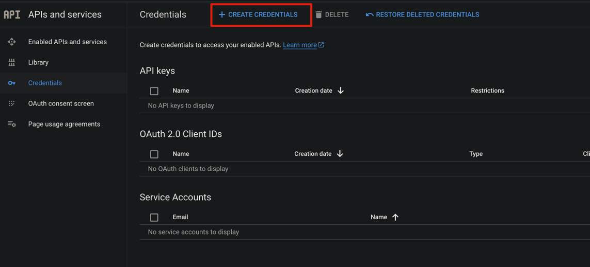
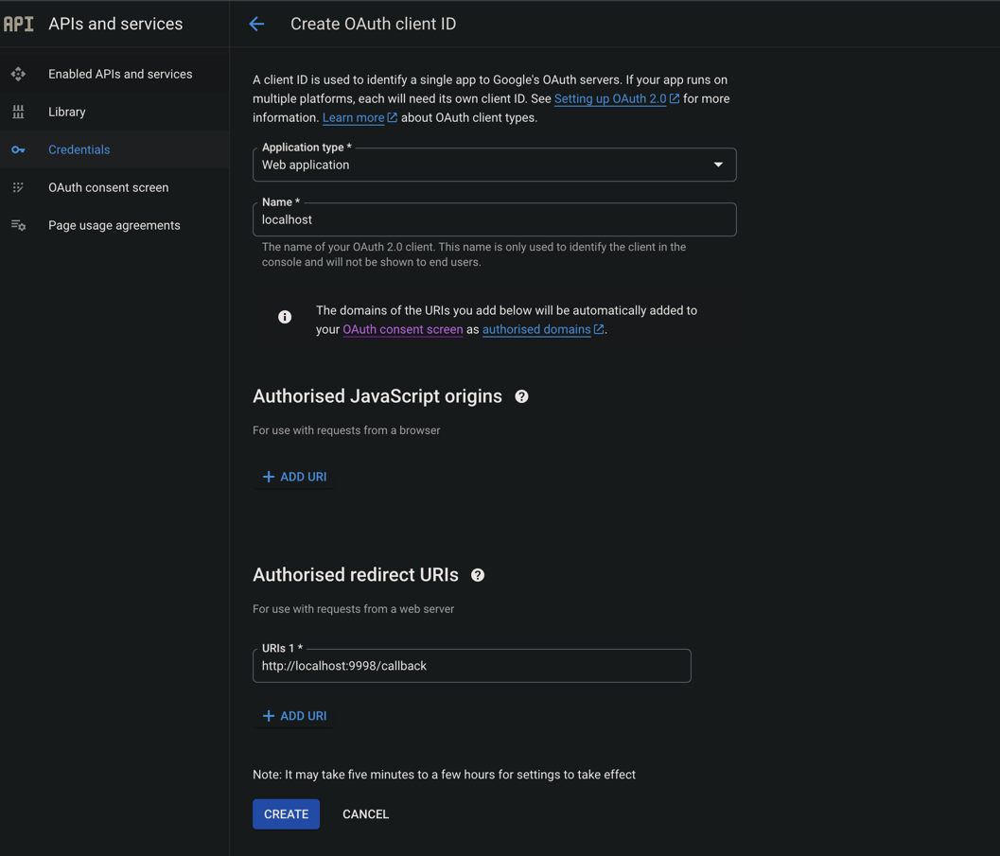
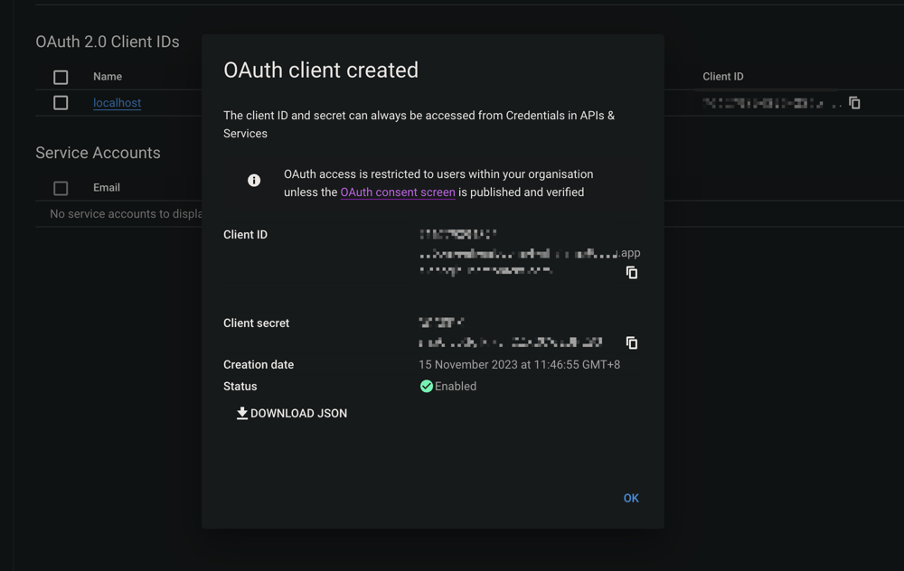
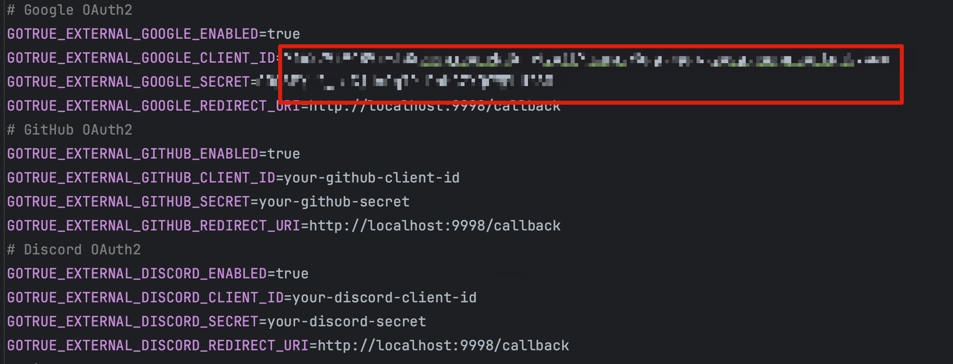

# Authentication

## Table of Contents
- [Authentication](#authentication)
   - [Google](#google)
      - [Creating a Google Cloud Platform Account](#creating-a-google-cloud-platform-account)
      - [Obtaining Client ID and Secret](#obtaining-client-id-and-secret)
      - [Setting Redirect URI](#setting-redirect-uri)
      - [Copying Credentials to .env](#copying-credentials-to-env)
   - [GitHub](#github)
      - [Setting up OAuth Application on GitHub](#setting-up-oauth-application-on-github)
      - [Registering Your OAuth Application](#registering-your-oauth-application)
      - [Updating .env with GitHub Credentials](#updating-env-with-github-credentials)
   - [Discord](#discord)
      - [Creating a New Discord Application](#creating-a-new-discord-application)
      - [Updating .env with Discord Credentials](#updating-env-with-discord-credentials)

## Google

Before you can use Sign in with Google, you need to obtain a [Google Cloud Platform account](https://console.cloud.google.com/) and have a project ready or create a new one.
Please follow this [guide](https://developers.google.com/identity/protocols/oauth2/web-server#creatingcred) to obtain the client ID and client secret.

For example, I create a project that used for localhost development. After creating a new project, you can add the OAuth 2.0 client ID by going to `APIs & Services` -> `Credentials` -> `Create Credentials` -> `OAuth client ID`.

Under 'Application type*', select 'Web application'.
The redirect URI should be `<your host server public ip/hostname>/gotrue/callback`. For example, my host server is `localhost`, so the redirect URI is `http://localhost/gotrue/callback`.

Copy the Client ID and Client Secret to the `.env` file.

## Github

## Setting up OAuth Application on GitHub

Begin by accessing your [GitHub Developer Settings](https://github.com/settings/developers):

1. Click on your profile photo at the top right corner.
2. Select 'Settings' from the dropdown menu.
3. Scroll down and select 'Developer settings' from the left sidebar.
4. Click 'OAuth Apps' in the same sidebar.

### Registering Your OAuth Application

1. In the 'OAuth Apps' section, click 'New OAuth App'.
2. Fill in the 'Application name' with your app's name.
3. For 'Homepage URL', provide the full URL to your app's homepage.
4. Specify your app's 'Authorization callback URL' where users will be redirected post-authorization. The redirect URI should be
`<your host server public ip/hostname>/gotrue/callback`. For example, my host server is `localhost`, so the redirect URI is `http://localhost/gotrue/callback`..
5. Click 'Register Application' at the bottom.
6. Once registered, securely store the generated OAuth credentials.
7. Copy and save your Client ID.
8. Click Generate a new client secret.

Update the `.env` file with the Client ID and Client Secret.

## Discord

1. Visit [Discord](https://discord.com).
2. Click 'Login' in the top right corner to access your account.

### Create a New Application

1. Once logged in, navigate to the [Discord Developer Portal](https://discord.com/developers/applications).
2. Click 'New Application' in the top right.
3. Name your application and select 'Create'.
4. In the settings menu, choose 'OAuth2'.
5. Under 'Redirects', select 'Add Redirect' and input your callback URL. The redirect URI should be `<your host server public ip/hostname>/gotrue/callback`.
For example, my host server is `localhost`, so the redirect URI is `http://localhost/gotrue/callback`.
6. Remember to 'Save Changes' at the bottom.
7. Under 'Client Information', note down your 'Client ID' and 'Client Secret' for later use.

Update the `.env` file with the Client ID and Client Secret.
