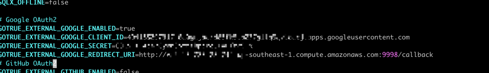

## Create an EC2 Instance

To create a default EC2 instance on AWS, you can follow these steps:

1. Open the Amazon EC2 console at [https://console.aws.amazon.com/ec2/](https://console.aws.amazon.com/ec2/).

2. In the navigation bar at the top of the screen, the current AWS Region is displayed. Select a Region in which to launch the instance. This is important because some Amazon EC2 resources can be shared between Regions, while others cannot.

3. From the Amazon EC2 console dashboard, choose "Launch instance."

4. (Optional) Under "Name and tags," for Name, enter a descriptive name for your instance.

5. Under "Application and OS Images (Amazon Machine Image)," choose "Quick Start," and then choose the ubuntu.

6. Under "Key pair (login)," for "Key pair name," choose an existing key pair or create a new one.

7. In the Summary panel, choose "Launch instance"


## Install Docker on EC2 Ubuntu

To install Docker on an Ubuntu server hosted on AWS, you typically follow these steps:

Add your user to the Docker group**: This lets your user run Docker commands without `sudo`. Run the following command to add your user to the Docker group:
   ```bash
   sudo usermod -aG docker ${USER}
   ```

1. Update your existing list of packages:
   ```bash
   sudo apt update
   ```

2. Install prerequisite packages which let `apt` use packages over HTTPS:
   ```bash
   sudo apt install apt-transport-https ca-certificates curl software-properties-common
   ```

3. Add the GPG key for the official Docker repository to your system:
   ```bash
   curl -fsSL https://download.docker.com/linux/ubuntu/gpg | sudo apt-key add -
   ```

4. Add the Docker repository to APT sources:
   ```bash
   sudo add-apt-repository "deb [arch=amd64] https://download.docker.com/linux/ubuntu $(lsb_release -cs) stable"
   ```

5. Update the package database with the Docker packages from the newly added repo:
   ```bash
   sudo apt update
   ```

6. Make sure you are about to install from the Docker repo instead of the default Ubuntu repo:
   ```bash
   apt-cache policy docker-ce
   ```

7. Finally, install Docker:
   ```bash
   sudo apt install docker-ce
   ```

8. Check that Docker is running:
   ```bash
   sudo systemctl status docker
   ```

Add your user to the Docker group, which will allow you to run Docker commands without `sudo`:
   ```bash
   sudo usermod -aG docker ${USER}
   ```

## Install AppFlowy-Cloud on EC2 Ubuntu

To install AppFlowy-Cloud on an EC2 Ubuntu instance, here's a streamlined guide:

1. **Clone the AppFlowy-Cloud Repository**:
   Access your EC2 instance via SSH and execute the following commands to clone the AppFlowy-Cloud repository and navigate into the directory:
   ```bash
   git clone https://github.com/AppFlowy-IO/AppFlowy-Cloud
   cd AppFlowy-Cloud
   ```

2. **Prepare the Configuration File**:
   Create a `.env` file from the provided template:
   ```bash
   cp dev.env .env
   ```

3. **Configure Gotrue Mailer**:
   Edit the `.env` file to set up the mailer for auto-confirmation:
   ```bash
   echo "GOTRUE_MAILER_AUTOCONFIRM=true" >> .env
   ```

4. **Customize `.env` Settings**:
   Open the `.env` file to replace placeholders with your instance details:
   ```bash
   vim .env
   ```
   (Here, replace placeholders with the actual Public IPv4 DNS or hostname of your EC2 instance.)

5. **Authentication Setup**:
   Please read the [Authentication documentation](./AUTHENTICATION.md) for instructions on setting up the authentication service.
   For example, replacing the Google OAuth2 credentials in the `.env` file with the EC2 Public IPv4 DNS:

   

6. **Start AppFlowy**:
   Use Docker to launch the AppFlowy services:
   ```bash
   docker-compose up -d
   ```

7. **Check Service Status**:
   Confirm that the services have started successfully:
   ```bash
   docker ps -a
   ```

Make sure to review and follow the authentication guide closely, adjusting the `.env` file as necessary for your specific setup.

## Helpful Docker Commands

Skip this section if you are already familiar with Docker. Be careful when running these commands. They can be destructive.

1. **Remove all containers in Docker**: 
   ```bash
   docker rm -f $(sudo docker ps -a)
   ```

2. **Restart the Docker service**: Sometimes, the Docker daemon might be in a state that prevents access. Restarting it can resolve the issue:
   ```bash
   sudo systemctl restart docker
   ```
3. **Clean up everything except volumes**: 
   ```bash
   docker system prune -af
   ```
4. **Remove volumes**:
   ```bash
   docker system prune -af --volumes
   ```

