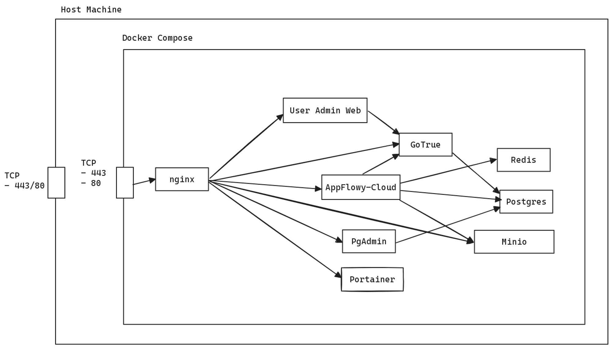

# AppFlowy Cloud: Comprehensive Guide

## Overview of File Structure

### Libraries (`libs`)
- `libs/client-api`: API client for interfacing with AppFlowy-Cloud.
- `libs/database`: Houses database schema and migration scripts.
- `libs/database-entity`: Definitions for database entities.
- `libs/gotrue`: Contains the GoTrue Authentication Server code.
- `libs/gotrue-entity`: Entity definitions for the GoTrue Auth Server.
- `libs/realtime`: Realtime server implementation.
- `libs/collab-rt-entity`: Realtime server entity definitions.
- `libs/infra`: Scripts and tools for infrastructure management.
- `libs/app_error`: Custom error types specific to AppFlowy-Cloud.

### Source Code (`src`)
- `src/api`: Endpoints and handlers for the AppFlowy-Cloud API.
- `src/biz`: Core business logic of the application.
- `src/middleware`: Middleware components for API processing.

### Configuration and Migration
- `configurations`: Contains essential configuration files for various services.
- `migrations`: Scripts for managing and migrating the Postgres database.

## Service Routing and Access

### Access Points Post Deployment
After executing `docker-compose up -d`, AppFlowy-Cloud is accessible at `http://localhost` on ports 80 and 443 with the following routing:

- `/gotrue`: Redirects to the GoTrue Auth Server.
- `/api`: AppFlowy-Cloud's HTTP API endpoint.
- `/ws`: WebSocket endpoint for AppFlowy-Cloud.
- `/web`: User Admin Frontend for AppFlowy.
- `/pgadmin`: Interface for Postgres database management.
- `/minio`: User interface for Minio object storage.
- `/portainer`: Tool for container management.

## Dockerization and Continuous Integration

#### Docker Images
AppFlowy leverages Docker for efficient deployment and scaling. Docker images are available at:
- `appflowy_cloud`: [Docker Hub](https://hub.docker.com/repository/docker/appflowyinc/appflowy_cloud/general)
- `admin_frontend`: [Docker Hub](https://hub.docker.com/repository/docker/appflowyinc/admin_frontend/general)

#### Automated Builds with GitHub Tags
The Docker images are automatically built and updated through a GitHub Actions workflow:

1. **Tag Creation**: A new tag in the GitHub repository indicates a new version or release.
2. **Automated Build Trigger**: This tag initiates the Docker image building process via GitHub Actions.
3. **Docker Hub Updates**: The `appflowy_cloud` and `admin_frontend` images are updated on Docker Hub with the latest build.
