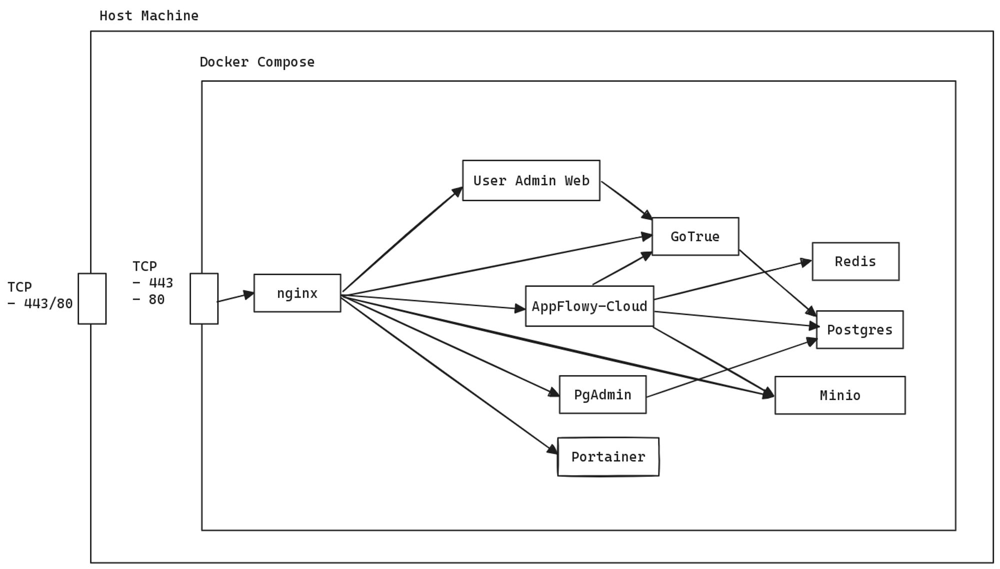

# AppFlowy Cloud: Comprehensive Guide

## Overview of File Structure

### Libraries (`libs`)
- `libs/client-api`: API client for interfacing with AppFlowy-Cloud.
- `libs/database`: Houses database schema and migration scripts.
- `libs/database-entity`: Definitions for database entities.
- `libs/gotrue`: Contains the GoTrue Authentication Server code.
- `libs/gotrue-entity`: Entity definitions for the GoTrue Auth Server.
- `libs/realtime`: Realtime server implementation.
- `libs/collab-rt-entity`: Realtime server entity definitions.
- `libs/infra`: Scripts and tools for infrastructure management.
- `libs/app_error`: Custom error types specific to AppFlowy-Cloud.

### Source Code (`src`)
- `src/api`: Endpoints and handlers for the AppFlowy-Cloud API.
- `src/biz`: Core business logic of the application.
- `src/middleware`: Middleware components for API processing.

### Configuration and Migration
- `configurations`: Contains essential configuration files for various services.
- `migrations`: Scripts for managing and migrating the Postgres database.

## Service Routing and Access

### Access Points Post Deployment
After executing `docker compose up -d`, AppFlowy-Cloud is accessible at `http://localhost` on ports 80 and 443 with the following routing:

- `/gotrue`: Redirects to the GoTrue Auth Server.
- `/api`: AppFlowy-Cloud's HTTP API endpoint.
- `/ws`: WebSocket endpoint for AppFlowy-Cloud.
- `/console`: User Admin Frontend for AppFlowy.
- `/pgadmin`: Interface for Postgres database management.
- `/minio`: User interface for Minio object storage.
- `/`, `/app`: AppFlowy Web.

### Self-Hosted User Onboarding & Whitelist
On the Community Self-Hosted edition, user onboarding is managed via the **Signup Settings / Whitelist** in the Admin Console (`/console/users-management?tab=settings`):

1. **Configure Whitelist**: An admin configures registration controls by adding authorized email domains (e.g., `yourcompany.com`) to the **Domain Whitelist** or specific email addresses to the **Email Whitelist**. Admins can combine domain and email whitelists for flexible onboarding.
2. **User Registration**: Users with matching email addresses register at `/signup`.
3. **Personal Workspace Creation**: Upon registration, each user is automatically provisioned as the **Owner** of their personal workspace. Users can create multiple personal workspaces.
4. **Per-Workspace Seat Limit**: The Community edition 1-seat limit applies **per workspace** (each workspace can have at most 1 member total: its owner).
   - *Example*: Alice can register and own *Workspace A* and *Workspace B*, but cannot invite Bob into *Workspace A* on Community edition.

---

### Reverse Proxy Authentication (`NEXT_PUBLIC_DISABLE_SERVER_ACTIONS`)
When deploying `admin_frontend` behind reverse proxies (Traefik, Nginx, Cloudflare Tunnels), set `NEXT_PUBLIC_DISABLE_SERVER_ACTIONS=true` in `.env` **when proxy-related cookie desynchronization occurs** (e.g., repeated redirect loops to `/login` after successful authentication).

#### Token Storage & Security Comparison Matrix

| Setting | Token Storage Location | Handling Mechanism | Security & Proxy Trade-off |
| :--- | :--- | :--- | :--- |
| **`false`** (Default) | HTTP-Only Cookies | Managed server-side by Next.js Server Actions | **High XSS Protection**: Tokens are unreadable by client JavaScript. Recommended unless reverse proxies strip Server Action cookies. |
| **`true`** (Reverse Proxy) | `localStorage` & `document.cookie` | Managed client-side by browser JavaScript | **Proxy Compatibility**: Resolves `/login` redirect loops behind proxies. Increases token exposure via `localStorage` (requires HTTPS & CSP vigilance). |

#### Security Hardening Checklist for Reverse Proxy Deployments
When `NEXT_PUBLIC_DISABLE_SERVER_ACTIONS=true` is enabled, apply the following reverse proxy security controls:

- [ ] **Enforce HTTPS**: Ensure TLS encryption is active across all endpoints (`SCHEME=https` in `.env` / `deploy.env`).
- [ ] **Forward Proxy Headers**: Ensure reverse proxies accurately pass `X-Forwarded-Host` and `X-Forwarded-Proto` headers.
- [ ] **Set Cookie Flags**: Preserve `Secure` and `SameSite=Lax` cookie flags to protect session tokens against Cross-Site Request Forgery (CSRF).
- [ ] **Content Security Policy (CSP)**: Configure strict CSP headers to protect tokens in `localStorage` from Cross-Site Scripting (XSS).

## Dockerization and Continuous Integration

#### Docker Images
AppFlowy leverages Docker for efficient deployment and scaling. Docker images are available at:
- `appflowy_cloud`: [Docker Hub](https://hub.docker.com/repository/docker/appflowyinc/appflowy_cloud/general)
- `admin_frontend`: [Docker Hub](https://hub.docker.com/repository/docker/appflowyinc/admin_frontend/general)
- `appflowy_web`: [Docker Hub](https://hub.docker.com/repository/docker/appflowyinc/appflowy_web/general)

#### Automated Builds with GitHub Tags
The Docker images are automatically built and updated through a GitHub Actions workflow:

1. **Tag Creation**: A new tag in the GitHub repository indicates a new version or release.
2. **Automated Build Trigger**: This tag initiates the Docker image building process via GitHub Actions.
3. **Docker Hub Updates**: The `appflowy_cloud` and `admin_frontend` images are updated on Docker Hub with the latest build.
