# Okta Authentication via SAML
- AppFlowy supports Identity Provider(Idp) that uses SAML Assertion
- One example of such Idp is [Okta](https://www.okta.com)
- After the setup, you will be able to launch AppFlowy from Okta
- Feel free to reach us on Discord or create a GitHub issue if you have any problems related to the integration

## Getting started
- This guide assumes the following
  - You are an Admin of Okta Identity Provider
  - You have AppFlowy-Cloud deployed [Deployment](./DEPLOYMENT.md)

## Steps (Okta)
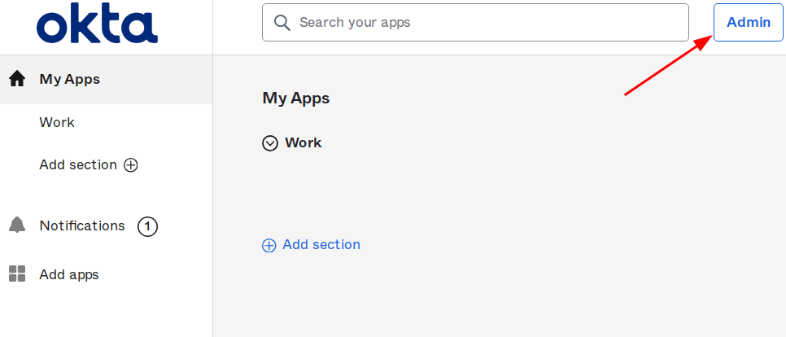
- Click "Admin" on the top right corner of Okta dashboard/home page

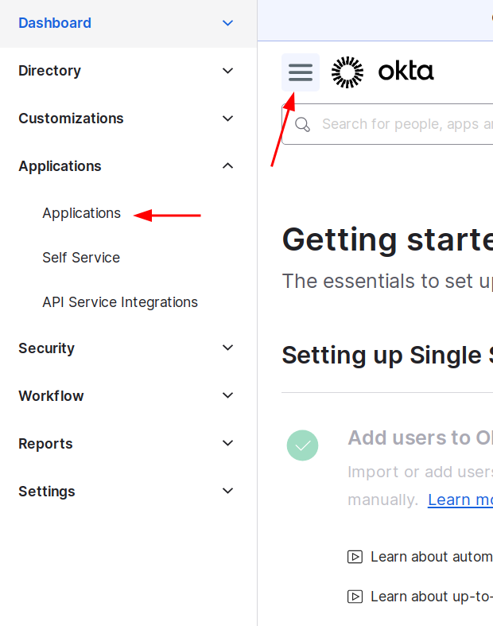
- Click the top left menu bar, then under "Applications", click "Applications"

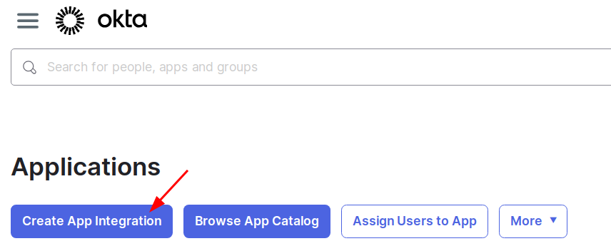
- Click "Create App Integration"

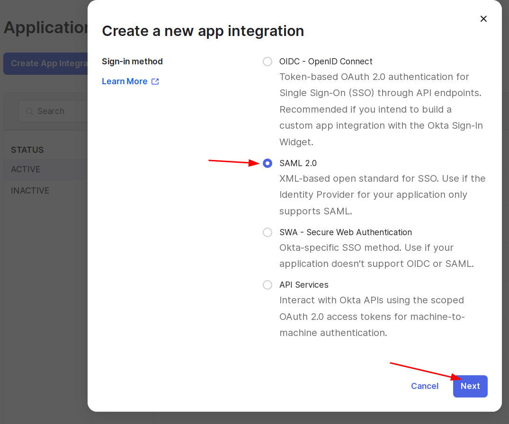
- Select SAML 2.0 then click "Next"

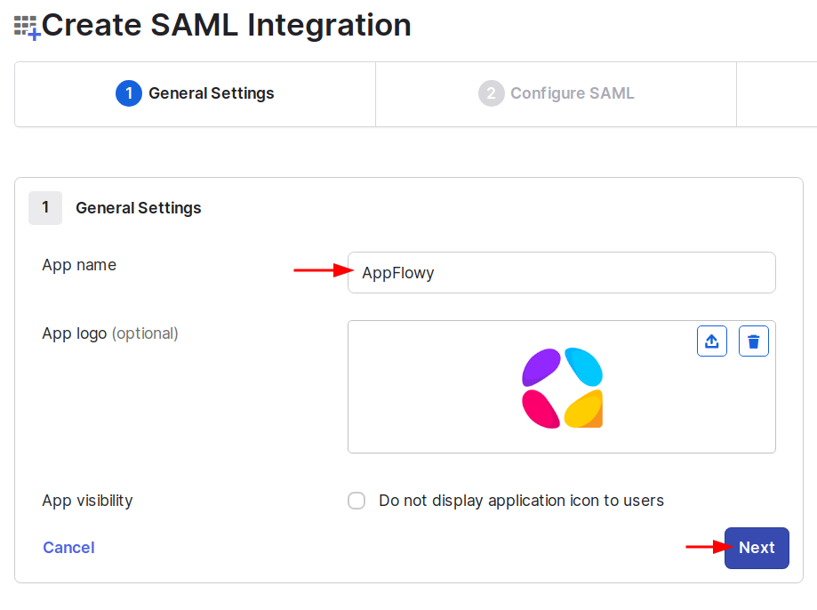
- In general settings, use "AppFlowy" as "App name"
- Optional: Select a logo
- Click "Next"

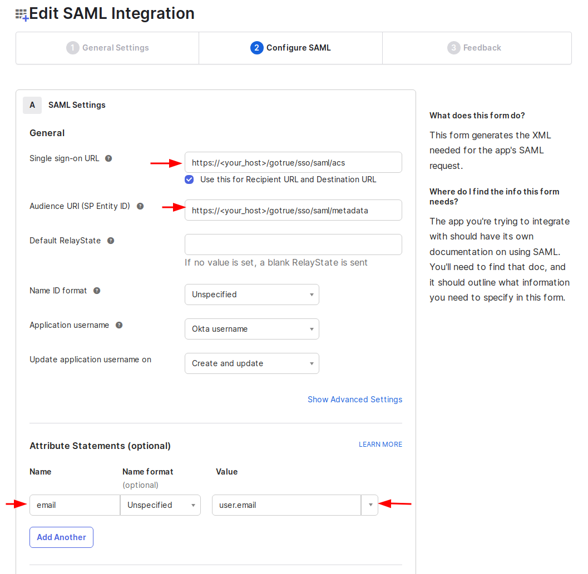
In General
- Use `https://<your_host>/gotrue/sso/saml/acs` for "Single sign-on URL"
- Use `https://<your_host>/gotrue/sso/saml/metadata` for "Audience URI (SP Entity ID)"
In Attribute Statements (optional)
- Use `email` for "Name"
- Select "user.email" in the drop down for "Value"
- Click "Next"

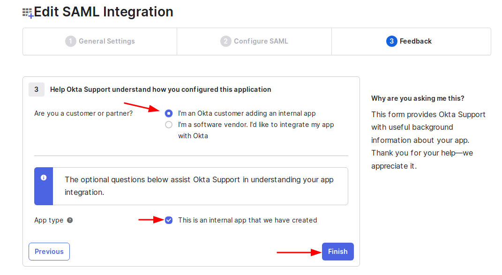
- Use `https://<your_host>/gotrue/sso/saml/acs` for "Single sign-on URL"
- Use `https://<your_host>/gotrue/sso/saml/metadata` for "Audience URI (SP Entity ID)"
In Attribute Statements (optional)
- Select "I'm an Okta customer adding an internal app"
- Tick "This is an internal app that we have created"
- Click "Finish"

## Steps (AppFlowy)
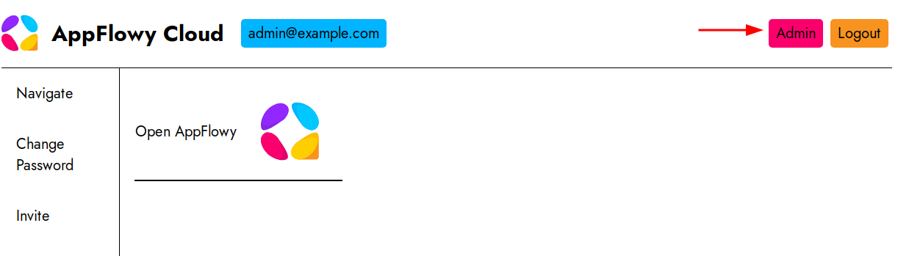
- Login as Admin in `https://<your_host>/web/login`
- Click "Admin" on the top right corner

- Login as Admin in `https://<your_host>/web/login`
- Click "Admin" on the top right corner

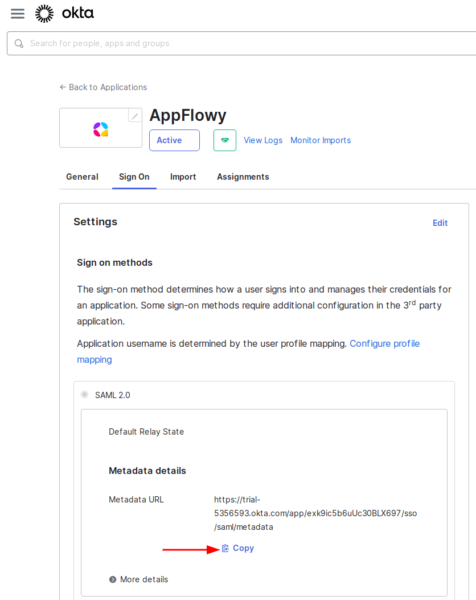
- Go back to okta, navigate to "Applications" -> "AppFlowy" -> "Sign On", then copy the Metadata URL

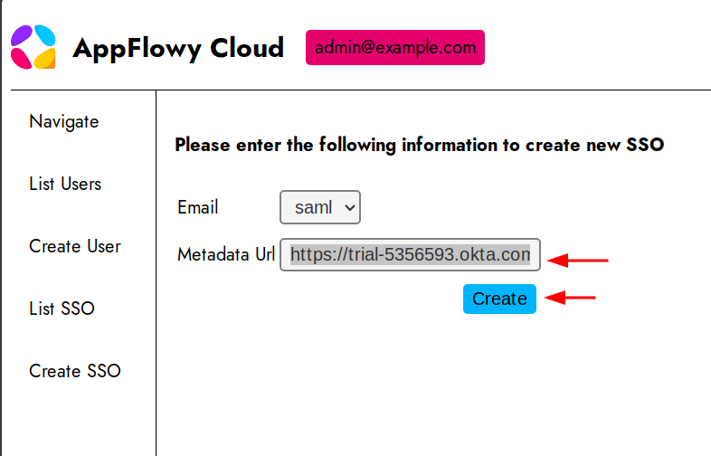
- In AppFlowy Admin page, Click on "Create SSO" on the left, paste the Metadata URL, then click "Create"

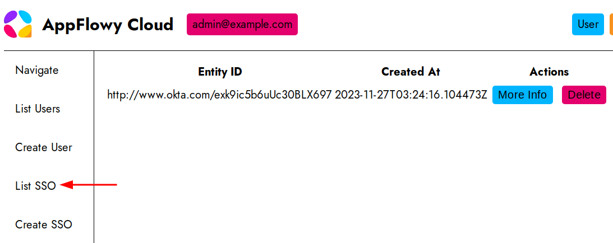
- In AppFlowy Admin page, Click on "List SSO", you should see the SSO being created

## App Visibility
In order for AppFlowy to be available for users, you may need to do the following
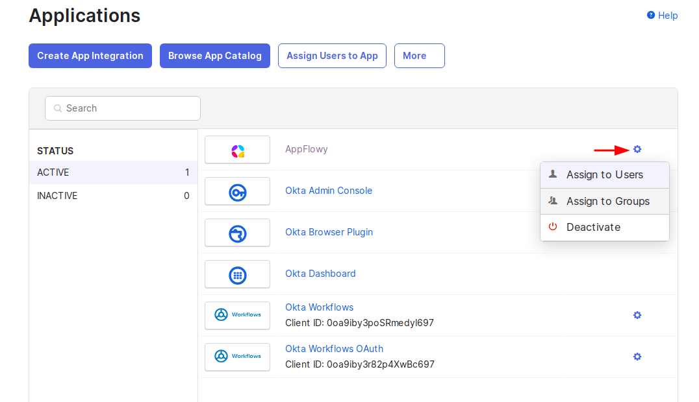
- In okta Admin -> "Applications" -> "AppFlowy", click on the settings icon
- Assign to various user or groups as needed by your organisation

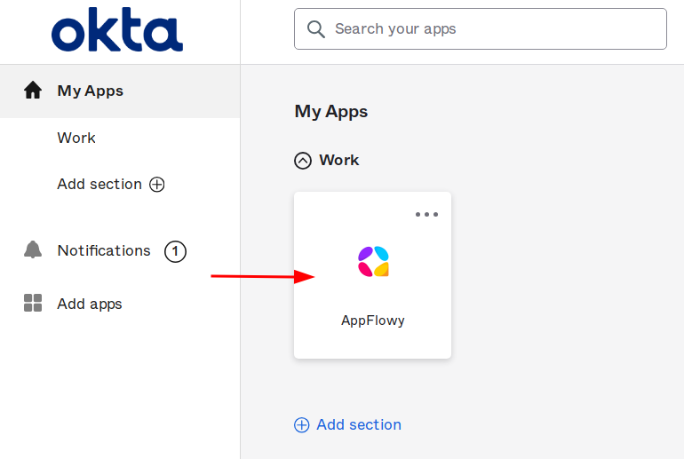
- In okta user page, you should see "AppFlowy" added
- Clicking on it should launch the App
