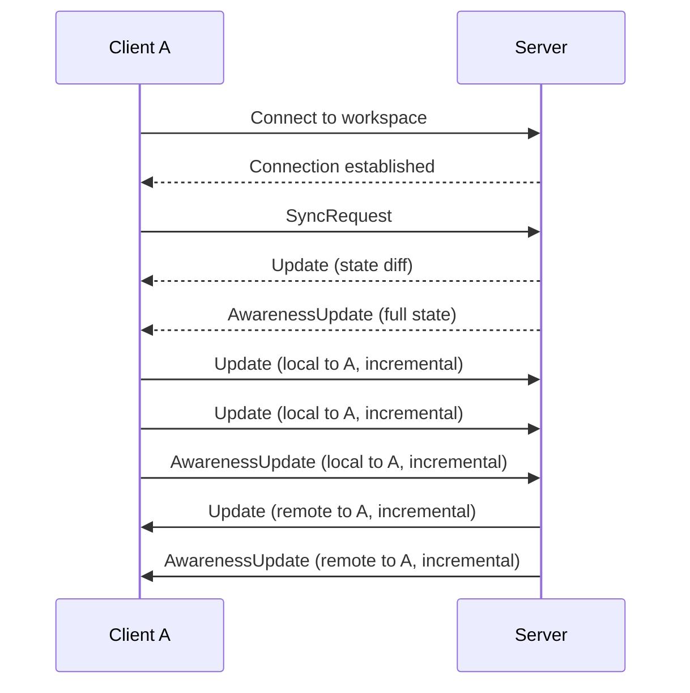

# Appflowy client server protocol (version 2.0)

This is the description of the client server protocol for Appflowy version 2.0.

## Motivation

A new sync protocol is designed with several goals in mind:

- **Simplicity**: unlike the first version, we focus on a minimal set of messages necessary for synchronization.
  We rely on the underlying transport layer to handle more complex scenarios (i.e. TCP acknowledgement &
  retransmission, HTTP authorization, packing/unpacking messages into TCP stream etc.).
- **Sharing**: a single connection should be enough to maintain synchronization between the client and server.
- **Easy to extend**: it should be easy to add new features to the protocol without breaking existing functionality.
  For this reason we use an existing serialization format (protobuf) which offers a good balance between performance,
  binary message size and backward and forward compatibility.

Currently, the sync v1 protocol has several limitations - like using fixed bincode formatting, which is Rust-specific
format that cannot be modified. It also covers a lot of concerns, such as acknowledgements, packing multiple messages
onto a single WebSocket frame (which prevents us from introducing new fields to the existing messages as messages are
not explicitly separated), sending big messages separately over HTTP (which requires separate coordination mechanism
between WS/HTTP requests).

## Overview

This protocol is designed to be simpler and more flexible, while still providing the necessary functionality. We assume
that **messages are processed in order, in which they arrive**. Also, all messages have to be handled. While some level
of tolerance is possible, in general dropping messages is not allowed, and it can possibly lead to either side dropping
the connection.

We also assume that all data fits into memory - current upper message size limit is set to 10MiB and supported as such
by the server and native client.

In sync v2, all communication between the client and server is organized within a scope of a workspace.
While it's possible to have multiple workspaces, the protocol is designed to work with a single connection per
workspace.

The protocol itself communicates over WebSocket and uses protobuf for required binary serialization.
In order to establish a connection, client must provide a set of parameters in URI query string:

```
ws://{host}/ws/v2/{workspaceId}?clientId={clientId}&deviceId={deviceId}&token={token}&lastMessageId={lastMessageId}
```

Where:

- `{host}` is the server host (ie. `localhost:8000`).
- `{workspaceId}` is the unique workspace identifier (UUID).
- `{clientId}` is the unique client (or current session) identifier - a 32bit unsigned integer that is also used between
  collab folder Y.Doc.clientId. It must be unique for each session (an application instance, running process, browser
  tab), but it can be reused as long as it's not concurrently used by two processes.
- `{deviceId}` is the unique device identifier - required for old compatibility with sync v1.
- `{token}` is the encrypted authentication token - used for user authentication.
- (optional) `{lastMessageId}` is the last message ID received by the client - if provided, the server will try to
  inform the client about collabs that were created since that message ID was received.

#### Sync protocol diagram

This is a basic sequence diagram that illustrates the initial connection and synchronization process between the client
and server. In practice, the relationship between request and response messages is not strictly enforced and can be
thought of as an independent message passing rather than request-response model.



### Messages

Once the connection is established, the client and server can exchange messages. That communication is fully
asynchronous and **DOESN'T** require to follow request-response pattern: some messages can trigger responses but that's
not guaranteed.

At this moment, the protocol supports several message types defined in `./libs/appflowy-proto/proto` folder:

```protobuf
message Message {
    oneof payload {
        collab.CollabMessage collab_message = 1;
        notification.WorkspaceNotification notification = 2;
    }
}
```

`Message` is a root-level message type that all other messages are wrapped in. Currently, it supports two types of
messages:

- `collab.CollabMessage` - used for collaborative editing of documents, similar to sync v1.
- `notification.WorkspaceNotification` - used for workspace-level notifications ie. user profile changes.

Collab sync messages are similar to yjs sync protocol, but they accommodate possibility to support multiple documents
and leave space for future changes (which original yjs protocol doesn't allow).

#### CollabMessage

All collab synchronization messages are wrapped in `CollabMessage` message type, which has the following structure:

```protobuf
message CollabMessage {    
    string object_id = 1;
    int32 collab_type = 2;
    oneof data {
        SyncRequest sync_request = 3;
        Update update = 4;
        AwarenessUpdate awareness_update = 5;
        AccessChanged access_changed = 6;
    }
}

```

Where:

- `object_id` is the unique identifier of the document (collab) that this message is related to. It's a UUID formatted
  as a string (i.e. `a573443f-d5c4-4533-a2ac-060af7e0`). While internally all collabs use native representation of UUID,
  for transport purposes it's serialized as a string (as it's simpler to interop across languages).
- `collab_type` is integer representing the type of the collab. It's required for compatibility purposes with existing
  system, possibly can be made obsolete in the future. Currently, this can be one of:
    - `0` - **Document** - a regular rich text document that can be edited collaboratively.
    - `1` - **Database** - database collab, similar to tabular data, which can contain multiple rows.
    - `2` - **WorkspaceDatabase** - workspace database collab.
    - `3` - **Folder** - a workspace folder collab, which in appflowy is used to maintain page tree hierarchy.
    - `4` - **DatabaseRow** - a single row in the **Database** collab, which can be edited collaboratively or promoted
      to Document-like view.
    - `5` - **UserAwareness** - a special collab type used to maintain user information i.e. profile data or reminders.
    - **Unknown** - used a placeholder for documents of different types.

The `data` field is one of the possible messages used in the collab synchronization process.

#### SyncRequest

`SyncRequest` is a message that can be sent by either client or server to request synchronization of the collab.

```protobuf
message SyncRequest {
    Rid last_message_id = 1;
    bytes state_vector = 2;
}
```

Where:

- (optional) `last_message_id` is the identifier ([Rid](#rid)) of the last update received from the server corresponding
  to this collab. If provided, the server will try to send only updates that were made after this message ID.
- `state_vector` is the Yjs/Yrs state vector encoded using lib0 v1 encoding. State vector describes the current document
  state as understood by Yjs. This information is used by the server to determine the difference between current state
  on the server and the client.

As a response to `SyncRequest`, the server/client should send a `CollabMessage` with `Update` data type, which contains
the actual Yjs document data that can be applied to Yjs Doc. Another message that can be sent in response is
`AwarenessUpdate`, which contains the full latest known awareness state.

Additionally, either of the server/client can send their own `SyncRequest` at any time to request the latest state known
by the client/server. This can happen when either side will determine that it has some missing updates known to the
other side.

Technically, there's no rule saying that `SyncRequest` must be replied with a single `Update`: since incremental updates
are send without request, as they come to the server, the server can send multiple `Update` messages in response to a
single `SyncRequest`.

#### Update

Update is a message that contains the actual Yjs document data that can be applied to Yjs Doc. This data can contain
either an incremental update change produces and send without request, or a full document state or difference between
document states requested by `SyncRequest`.

```protobuf
message Update {
    Rid message_id = 1;
    uint32 flags = 2;
    bytes payload = 3;
}
```

Where:

- `message_id` is the identifier ([Rid](#rid)) of this update message. Since message ids are only generated by the
  server, client can omit this field.
- `flags` is a number that can be used to indicate special properties of the update. A multiple flags can be
  combined in a single value using bitwise OR operation. Currently supported flags:
    - `0x00` - update is encoded using lib0 v1 encoding, which is the default encoding used by Yjs.
    - `0x01` - update is encoded using lib0 v2 encoding, which is a more efficient encoding that can be used for
      larger updates, but slower and bigger for smaller (i.e. incremental) updates.
    - In the future other flags may be added i.e. type of compression used.

Server sends all incremental updates related to the workspace, that current connection is established for, as this
allows us:

1. To scale to any arbitrary number of collabs.
2. With the assumption that the client will eventually want to synchronize the entire
   workspace (which is advantageous for offline & native apps) use without explicitly requesting for collabs one by one.
3. Even with dozens of active users, it's still cheaper to send all updates (that may be eventually needed anyway) than
   to iterate stream of unmerged updates for each collab separately.

#### AwarenessUpdate

`AwarenessUpdate` is a message that contains information about the current user Yjs awareness state. This awareness
state contains temporary information about the user i.e. current cursor position, color, username etc.

```protobuf
message AwarenessUpdate {
    bytes payload = 1;
}
```

Where:

- `payload` is the awareness state encoded using lib0 v1 encoding.

Awareness updates don't depend on each other and can be sent at any time by either client or server. By default, when
the client sends a `SyncRequest`, server will also reply with the latest awareness state for the collab if such exists.
The following awareness updates can also be incremental (they contain only changes to the awareness state, not a full
state).

#### AccessChanged

`AccessChanged` is a message that contains information about the access rights changes for the collab. This message can
only be sent by the server.

```protobuf
message AccessChanged {
    bool can_read = 1;
    bool can_write = 2;
    int32 reason = 3;
}
```

Where:

- `can_read` is a boolean value indicating whether the user has read access to the collab.
- `can_write` is a boolean value indicating whether the user has write access to the collab.
- `reason` is an integer value indicating the reason for the access change. This can be used to determine
  whether the access was changed by the user, by the server or due to some other reason (i.e. document deletion).
  Currently supported values:
    - `0` - **PermissionDenied** - the user doesn't have permission to access the collab.
    - `1` - **ObjectDeleted** - the collab was deleted and the user no longer has access to it.

> In the future we also want to propose `Reset` message that would carry a full document state, whose goal is to force
> the client to reset its own document state to the one provided.

#### RID

All updates are stored in the Redis stream before they are merged into main document - this is because
the change of entire document is a heavy task, while individual updates (eg. text edits triggered by keyboard strokes)
are very small and very frequent. Streams are used on per workspace basis, which allows us to scale to any number of
documents, track the usage according to specific user or organization etc.

`Rid` (short for **R**edis stream **ID**) is a message ID used to identify messages in the Redis stream. It's used only
in the context of the document update. Each rid can be represented as `{timestamp}-{sequence}` where:

- `{timestamp}` is the UNIX timestamp in milliseconds when the message was received by Redis.
- `{sequence}` is a monotonically increasing sequence number used to guarantee uniqueness of the message ID. For most of
  the time it's equal to 0.

Every collab update received from the server has a `Rid` field. It can be used for several potential features:

1. A `timestamp` field can be used by the client to filter updates by date.
2. A `timestamp` field can also be used to mark the last time when the collab update **was made public**. It's not the
   same as when the document update was made though, since timestamp is assigned by the server for the first time it
   received a given update, while the updates themselves could have been made by the client while offline.

## Using protobuf in the web client

Using protobuf in the web client requires some additional steps, as the browser doesn't support native protobuf. We can
bridge this via `protobufjs-cli`:

```bash
pnpm install -g protobufjs-cli
```

Once this is done we need to generate the JavaScript code from the protobuf definitions, available under
`./libs/appflowy-proto/proto` path:

```bash
# generate JavaScript code from protobuf definitions
pbjs -t status-module -w es6 -o ./path/to/output.js ./libs/appflowy-proto/proto/messages.proto

# generate TypeScript definitions from protobuf definitions
pbts -o ./path/to/output.d.ts ./path/to/output.js
```

Once this is done, we can import the generated code in our web client:

```javascript
import {messages} from './path/to/output';
import * as Y from 'yjs';
import * as awarenessProtocol from 'y-protocols/awareness.js'

const ws = new WebSocket(`wss://localhost:8000/ws/v2/{workspaceId}?clientId={clientId}&deviceId={deviceId}&token={token}`);
ws.binaryType = 'arraybuffer';
ws.onmessage = (event) => {
    const msg = messages.Message.decode(new Uint8Array(event.data));
    if (msg.collabMessage) {
        const origin = 'remote'
        const msg = msg.collabMessage;
        const {ydoc, awareness} = getYDoc(msg.objectId); // get Y.Doc instance by objectId
        if (msg.syncRequest) {
            // handle sync request
            const diff = Y.encodeStateAsUpdateV2(ydoc, msg.syncRequest.stateVector);
            ws.send(messages.Message.encode({
                collabMessage: {
                    objectId: msg.objectId,
                    collabType: msg.collabType,
                    update: {
                        flags: 0x01, // lib0 v2 encoding
                        payload: diff,
                    }
                }
            }).finish());
        } else if (msg.update) {
            // handle update message
            const update = msg.update.payload;
            // check if update is encoded using lib0 v2 encoding
            const isV2 = msg.update.flags & 0x01 !== 0;
            if (isV2) {
                // apply decoded update to Y.Doc
                Y.applyUpdateV2(ydoc, decodedUpdate, origin);
            } else {
                // apply update directly if it's in lib0 v1 encoding
                Y.applyUpdate(ydoc, update, origin);
            }
        } else if (msg.awarenessUpdate) {
            // handle awareness update
            awarenessProtocol.applyAwarenessUpdate(awareness, msg.awarenessUpdate.payload, origin);
        } else if (msg.accessChanged) {
            // handle access changed message
        }
    } else if (msg.notification) {
        // handle notification
    }
};

// sending a message
let syncReq = messages.Message.encode({
    collabMessage: {
        objectId: ydoc.guid, // ie. 'a573443f-d5c4-4533-a2ac-060af7e0',
        collabType: 0,
        syncRequest: {
            stateVector: Y.encodeStateVector(ydoc),
        }
    }
}).finish();
ws.send(syncReq);

// sending incremental updates
ydoc.on('update', (update, origin) => {
    if (isRemote(update)) {
        // don't resend updates received from the server
        return;
    }
    let updateMsg = messages.Message.encode({
        collabMessage: {
            objectId: ydoc.guid,
            collabType: 0, // Document collab type
            update: {
                flags: 0x00, // lib0 v1 encoding
                payload: update,
            }
        }
    }).finish();
    ws.send(updateMsg);
})
```