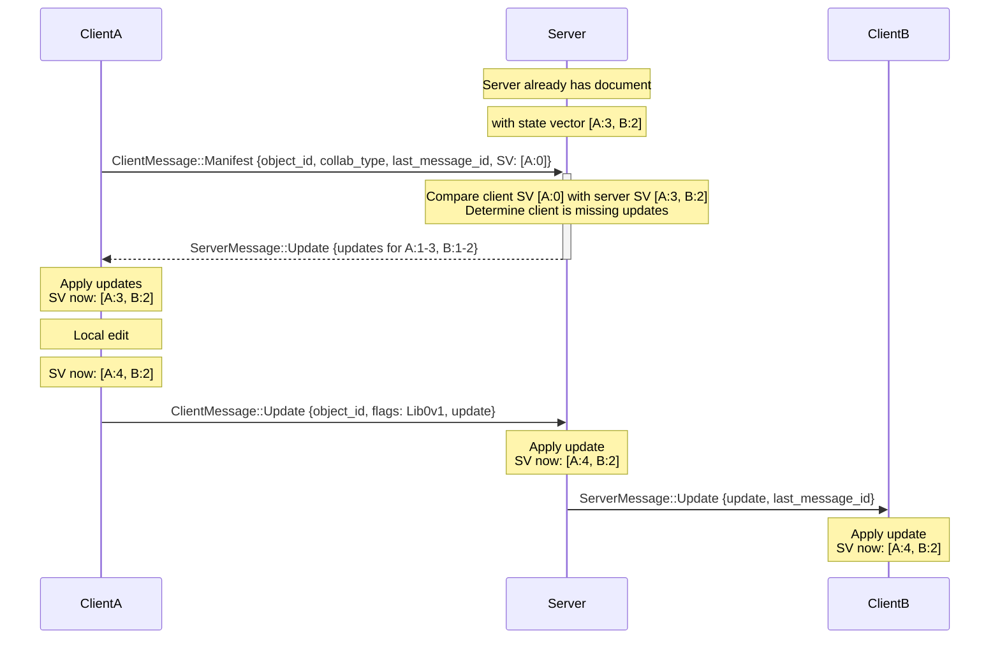
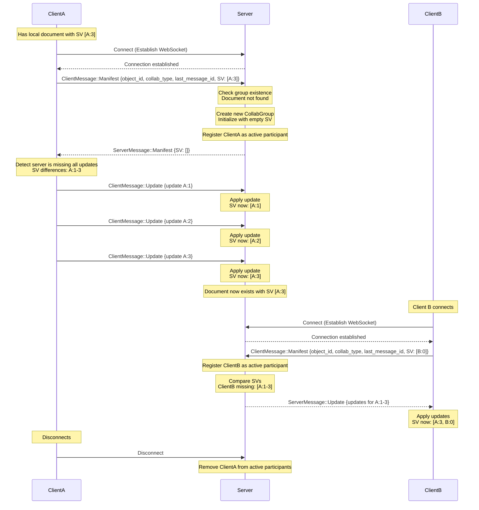

## Message Types

### 1. Client to Server Messages


### 2. Server to Client Messages


## Real-time Collaboration & Synchronization

The AppFlowy collaboration system uses a sophisticated synchronization mechanism that handles both real-time editing and
offline changes seamlessly. This section describes how the synchronization process works in different scenarios.

### Normal Synchronization Flow

The synchronization flow varies depending on whether the server already has the document or it's being created for the
first time. Both scenarios follow specific protocols to ensure consistency.

#### Case 1: Server Already Has the Document

When a client connects to a document that already exists on the server:



In this scenario:

1. Client connects with an empty or outdated state vector
2. Server detects the difference between client's SV and server's SV
3. Server sends all missing updates in a single message
4. Client applies updates to catch up with server state
5. Normal editing can then proceed with real-time updates

#### Case 2: Server Does Not Have the Document

When a client connects with a document the server doesn't know about:



In this scenario:

1. Client connects to the server and establishes a WebSocket connection
2. Client sends a Manifest message for a document the server doesn't know about
3. Server creates a new CollabGroup for this document and registers the client as an active participant
4. Client detects the server is missing all local updates
5. Client sends all local updates to the server
6. Server builds up its document state from client updates
7. When other clients connect, they are registered as active participants and receive the updates
8. When a client disconnects, it's removed from the active participants list

The server maintains a list of active participants (subscribers) for each document, which allows it to:

- Send updates to all connected clients when changes occur
- Clean up resources when clients disconnect
- Handle reconnections efficiently

Key differences between the two scenarios:

- In Case 1, the server sends missing updates to the client
- In Case 2, the client sends missing updates to the server
- Case 2 establishes a new document on the server
- Both cases result in consistent document states across all clients

When a client makes changes in normal operation:

1. Changes are made locally first and immediately applied to the local document
2. The client's state vector is updated to reflect the new operation
3. The update is sent to the server with a message ID (Rid) and the current state vector
4. The server processes the update through its group-based architecture:
    - `handle_client_collab_message` validates the message and user
    - `forward_message_to_group` routes it to the appropriate CollabGroup
    - `handle_protocol_message` processes the message based on its type
    - The update is applied to the server's document
5. The server broadcasts the update to all other connected clients of that document
6. Each receiving client:
    - Applies the update to their local document
    - Updates their state vector and last_message_id

### Offline Editing & Reconnection


The offline editing and reconnection process contains these key phases:

1. **Disconnection Phase**:
    - Client disconnects (intentionally or due to network issues)
    - Client maintains local document state and continues tracking changes
    - All edits update the local state vector but are stored in memory

2. **Concurrent Edits Phase**:
    - While Client B is offline, Client A continues making changes
    - Server state advances with Client A's updates
    - State vector divergence occurs between clients

3. **Reconnection Phase**:
    - On reconnection, client sends a Manifest message with:
        - Its current state vector [A:1, B:2]
        - Last received message ID
    - This triggers the `publish_pending_collabs` mechanism in the client

4. **Reconciliation Phase**:
    - Server compares client's state vector with its own
    - Identifies missing updates on both sides
    - Server discovers it needs to send [A:2] to client
    - Server discovers it's missing [B:1, B:2] from client

5. **Two-way Synchronization Phase**:
    - Server sends missing updates to client
    - Client sends its local changes to server
    - Using `calculate_missing_update` function on the server

6. **Propagation Phase**:
    - Server broadcasts newly received updates to all other clients
    - All clients converge to the same state [A:2, B:2]

The offline editing capability is made possible by:

- Local-first edits with CRDT data structures
- State vector tracking to identify precisely what updates are missing
- Two-way synchronization on reconnection
- The `WorkspaceController` client implementation that manages connection state

## Resilience Mechanisms

The AppFlowy collaboration system implements several mechanisms to ensure reliability and consistency across various
challenging scenarios.

### Resource ID (Rid) Management


Resource IDs (Rid) provide a robust ordering mechanism for updates, ensuring consistency even when messages arrive out
of order:

```rust
pub struct Rid {
    pub timestamp: i64,  // UNIX timestamp when update was created
    pub seq_no: u16,     // Sequence number for same-timestamp updates
}

impl Ord for Rid {
    fn cmp(&self, other: &Self) -> Ordering {
        match self.timestamp.cmp(&other.timestamp) {
            Ordering::Equal => self.seq_no.cmp(&other.seq_no),
            ordering => ordering,
        }
    }
}
```

#### Detailed Rid Implementation and Purpose

The Rid mechanism is a critical component for maintaining causal consistency in the distributed CRDT system. It provides
several key functionalities:

1. **Message Identification**: Each update is assigned a unique Rid that contains:
    - A timestamp (Unix milliseconds) when the update was created
    - A sequence number to distinguish between updates created at the same millisecond

2. **Total Ordering**: Rids establish a clear, total ordering of all updates across the system:
   ```rust
   // In libs/appflowy-proto/src/shared/rid.rs
   impl PartialOrd for Rid {
     fn partial_cmp(&self, other: &Self) -> Option<Ordering> {
       Some(self.cmp(other))
     }
   }
   
   impl Ord for Rid {
     fn cmp(&self, other: &Self) -> Ordering {
       match self.timestamp.cmp(&other.timestamp) {
         Ordering::Equal => self.seq_no.cmp(&other.seq_no),
         ordering => ordering,
       }
     }
   }
   ```

3. **Causal History Tracking**: By tracking the last received Rid (`last_message_id`), the system can:
    - Detect and ignore duplicate messages
    - Process messages in causal order even if they arrive out of transport order

#### Default Rid Usage (Rid::default)

The `Rid::default()` is used in several key scenarios:

1. **Initial Connection**: When a client first connects, it uses `Rid::default()` as its initial `last_message_id`:
   ```rust
   // In client_api/src/v2/db.rs
   pub fn last_message_id(&self) -> Result<Rid, AppError> {
     match self.get_last_message_id() {
       Some(rid) => Ok(rid),
       None => Ok(Rid::default()),
     }
   }
   ```
   This default value (timestamp: 0, seq_no: 0) ensures that any valid update will be newer.

2. **Manifest Messages**: When a client sends its first Manifest during initial sync, it may use Rid::default() when it
   has no history:
   ```rust
   // In client_api/src/v2/actor.rs
   let manifest = ClientMessage::Manifest {
     object_id,
     collab_type: CollabType::Unknown,
     last_message_id: last_message_id.unwrap_or_default(),
     state_vector: sv.encode_v1(),
   };
   ```

3. **Server-side Origin Marking**: The server uses Rid to track message origins:
   ```rust
   // In services/appflowy-collaborate/src/group/group_init.rs
   if let ActionSource::Remote(rid) = source {
     if rid > current_last_message_id {
       // Update the last message id
       update_last_message_id(rid);
     }
   }
   ```

4. **Conflict Resolution**: When handling conflicts during reconnection, the system uses Rid comparisons to determine
   which update takes precedence:
   ```rust
   // In client_api/src/v2/actor.rs
   last_message_id.rcu(|old| {
     if rid > **old {
       Arc::new(rid)
     } else {
       old.clone()
     }
   });
   ```

#### Rid in Server-Side Implementation

In the server implementation (`services/appflowy-collaborate`), Rids play a crucial role:

1. **Update Ordering**: The `GroupCommandRunner` in the server uses Rids to process updates in the correct order:
   ```rust
   // Pseudocode based on services/appflowy-collaborate/src/group/group_init.rs
   async fn handle_update(
     state: &CollabGroupState,
     origin: &CollabOrigin,
     update: Vec<u8>,
     rid: Rid,
   ) -> Result<(), RTProtocolError> {
     // Process update
     // Track the Rid for this update in the server state
     state.update_last_message_id(rid);
     // Forward update to other clients with this Rid
     broadcast_to_subscribers(update, rid);
   }
   ```

2. **Update Validation**: The server verifies if an update is already applied using Rid comparison:
   ```rust
   // Simplified implementation
   if received_rid <= last_processed_rid {
     // Update already processed, can be ignored
     return Ok(());
   }
   ```

3. **Message Forwarding**: When broadcasting updates to other clients, the server includes the original Rid:
   ```rust
   // In services/appflowy-collaborate/src/group/group_init.rs
   let message = BroadcastSync::new(
     sender,
     object_id.to_string(),
     payload,
     seq_num,
     original_rid
   );
   ```

#### Benefits of Rid-based Ordering

- **Global Ordering**: Provides total ordering of updates across all clients
- **Idempotency**: Duplicate update detection by tracking last_message_id
- **Out-of-order Handling**: Later updates are recognized even if they arrive first
- **Reconnection Efficiency**: Clients request updates newer than their last_message_id
- **Causality Preservation**: Updates are applied in a causally consistent order
- **Conflict Resolution Support**: Rid ordering helps resolve conflicts when merged

The Rid mechanism, combined with CRDT state vectors, forms the foundation of AppFlowy's robust synchronization system,
providing consistent document states even in challenging network conditions.

### Disconnection and Reconnection

When a client disconnects, the system:

- Keeps local changes in memory and continues tracking the state vector
- Updates client state to `ConnectionStatus::Disconnected`
- Uses the `ReconnectionManager` to attempt reconnection with exponential backoff

```rust
async fn handle_disconnect(&self) -> anyhow::Result<()> {
    let previous_status = self
        .status_tx
        .send_replace(ConnectionStatus::Disconnected { reason: None });
    // ... disconnect logic
}
```

The reconnection process is managed by a dedicated `ReconnectionManager` that:

- Attempts reconnection with exponential backoff
- Monitors connection state changes
- Triggers reconnection automatically for retriable disconnection reasons
- Implements circuit breaker patterns to prevent excessive reconnection attempts

### Detecting Missing Updates

The system continuously monitors for missing updates using a specialized detection mechanism:

```rust
fn has_missing_updates<T: ReadTxn>(tx: &T) -> bool {
    let store = tx.store();
    let missing = store.pending_update().is_some() || store.pending_ds().is_some();
    // If missing, it triggers a new manifest request
    missing
}
```

This function checks the underlying CRDT store to determine if there are:

- Pending updates that haven't been integrated
- Pending delete sets that haven't been applied

When missing updates are detected, the system automatically triggers a new Manifest message to request the missing data.

### Awareness Updates for Real-time Presence

The system handles cursor position and user presence separately from document content:

```rust
fn publish_awareness(
    &self,
    object_id: ObjectId,
    collab_type: CollabType,
    update: AwarenessUpdate,
) {
    let awareness = update.encode_v1();
    let msg = ClientMessage::AwarenessUpdate {
        object_id,
        collab_type,
        awareness,
    };
    self.trigger(WorkspaceAction::Send(msg, ActionSource::Local));
}
```

This separation provides several benefits:

- Lower latency for presence updates (cursor positions, selections)
- Continued awareness of other users even during document sync issues
- Reduced bandwidth usage by separating high-frequency presence updates from document changes
- Improved user experience with real-time feedback on collaborative activities

#### Resource ID (Rid) Sequence Flow

The following sequence diagram illustrates how Resource IDs (Rids) are created, propagated, and used throughout the
collaboration process:

```mermaid
sequenceDiagram
    participant ClientA
    participant Server
    participant ClientB
    Note over ClientA, ClientB: Initial Connection Phase
    ClientA ->>+ Server: Connect (no previous messages)
    Server -->>- ClientA: Connected
    Note over ClientA: Initialize with<br>last_message_id = Rid::default()<br>{timestamp: 0, seq_no: 0}
    ClientA ->>+ Server: ClientMessage::Manifest<br>{last_message_id: Rid::default(), SV: [A:0]}
    Server -->>- ClientA: ServerMessage::Manifest (empty)
    Note over ClientA, ClientB: Update Creation and Propagation
    Note over ClientA: Local edit at t=1000ms
    Note over ClientA: Create Rid {1000, 1}<br>Update SV to [A:1]
    ClientA ->>+ Server: ClientMessage::Update<br>{update, flags, Rid: {1000, 1}}
    Note over Server: Store update with Rid {1000, 1}<br>Update last_message_id if {1000, 1} > current
    Server ->>- ClientB: ServerMessage::Update<br>{update, last_message_id: {1000, 1}}
    Note over ClientB: Compare received Rid {1000, 1}<br>with current last_message_id Rid::default()<br>{1000, 1} > {0, 0}, so update
    Note over ClientB: last_message_id = {1000, 1}<br>Apply update<br>Update SV to [A:1, B:0]
    Note over ClientA, ClientB: Multiple Edits With Same Timestamp
    Note over ClientA: Two rapid edits at t=1500ms
    Note over ClientA: Create Rid {1500, 1} for first edit<br>Update SV to [A:2]
    ClientA ->>+ Server: ClientMessage::Update<br>{update1, flags, Rid: {1500, 1}}
    Note over Server: Store update with Rid {1500, 1}
    Note over ClientA: Create Rid {1500, 2} for second edit<br>Update SV to [A:3]
    ClientA ->> Server: ClientMessage::Update<br>{update2, flags, Rid: {1500, 2}}
    Note over Server: Process in order (seq_no ensures ordering)
    Server ->>- ClientB: ServerMessage::Update<br>{update1, last_message_id: {1500, 1}}
    Server ->> ClientB: ServerMessage::Update<br>{update2, last_message_id: {1500, 2}}
    Note over ClientB: Apply updates in order<br>last_message_id = {1500, 2}<br>SV = [A:3, B:0]
    Note over ClientA, ClientB: Out of Order Message Reception
    Note over ClientB: Local edit at t=2000ms
    Note over ClientB: Create Rid {2000, 1}<br>Update SV to [A:3, B:1]
    ClientB ->>+ Server: ClientMessage::Update<br>{update, flags, Rid: {2000, 1}}
    Note over Server: Network delay for message 1
    Note over ClientB: Local edit at t=2200ms
    Note over ClientB: Create Rid {2200, 1}<br>Update SV to [A:3, B:2]
    ClientB ->> Server: ClientMessage::Update<br>{update, flags, Rid: {2200, 1}}
    Note over Server: Message 2 arrives first due to network conditions
    Server ->> ClientA: ServerMessage::Update<br>{update, last_message_id: {2200, 1}}
    Note over ClientA: Update last_message_id = {2200, 1}<br>Apply update<br>SV = [A:3, B:1]
    Note over Server: Later, message 1 arrives
    Server ->>- ClientA: ServerMessage::Update<br>{update, last_message_id: {2000, 1}}
    Note over ClientA: Compare received Rid {2000, 1}<br>with current last_message_id {2200, 1}<br>{2000, 1} < {2200, 1}, so don't update last_message_id<br>But still apply the update<br>SV = [A:3, B:2]
    Note over ClientA, ClientB: Reconnection After Disconnect
    Note over ClientB: Disconnects
    Note over ClientA: Edit while ClientB disconnected<br>Create Rid {3000, 1}<br>SV = [A:4, B:2]
    ClientA ->> Server: ClientMessage::Update<br>{update, flags, Rid: {3000, 1}}
    Note over Server: Server stores update<br>last_message_id = {3000, 1}
    Note over ClientB: Reconnects with last_message_id = {2200, 1}
    ClientB ->>+ Server: ClientMessage::Manifest<br>{last_message_id: {2200, 1}, SV: [A:3, B:2]}
    Note over Server: Server detects ClientB<br>is missing update with Rid {3000, 1}
    Server -->>- ClientB: ServerMessage::Update<br>{update, last_message_id: {3000, 1}}
    Note over ClientB: Updates last_message_id = {3000, 1}<br>Applies update<br>SV = [A:4, B:2]
    Note over ClientA, ClientB: Duplicate Message Handling
    Note over Server: Network hiccup causes<br>duplicate message to be sent
    Server ->> ClientB: ServerMessage::Update<br>{update, last_message_id: {3000, 1}} (duplicate)
    Note over ClientB: Compare received Rid {3000, 1}<br>with current last_message_id {3000, 1}<br>Equal, so ignore update<br>SV remains [A:4, B:2]
```



This detailed diagram illustrates key Rid operations:

1. **Initialization**: Clients start with `Rid::default()` as their last_message_id
2. **Update Creation**: New updates generate new Rids with current timestamp and incrementing sequence numbers
3. **Ordering Guarantee**: Sequence numbers ensure ordering even when timestamps are identical
4. **Out-of-Order Processing**: Later updates (by timestamp) are recognized even if they arrive first
5. **Reconnection**: The last_message_id helps identify what updates a reconnecting client is missing
6. **Duplicate Detection**: Comparing incoming Rid with stored last_message_id prevents duplicate processing

The Rid system ensures that even in challenging network conditions with message delays, out-of-order delivery, or
duplicates, the document state remains consistent across all clients.

## ClientID Management in Collaborative Editing

In collaborative editing systems, ClientIDs play a crucial role in identifying the source of changes and managing
document history. AppFlowy's implementation uses a sophisticated approach to handle ClientIDs efficiently across both
client and server environments.

### Understanding ClientIDs


#### What is a ClientID?

In the CRDT (Conflict-free Replicated Data Type) system used by AppFlowy:

1. **ClientID Definition**: A 32-bit integer that uniquely identifies a client instance within the collaborative editing
   system
2. **Role in State Vector**: Each entry in a state vector maps a ClientID to a sequence number of operations
3. **Role in Updates**: Every change in the document is tagged with the originating ClientID

For example, in a state vector like `{230465152: 3, 1542987393: 3, ...}`, the numbers `230465152` and `1542987393` are
ClientIDs, while the value `3` indicates that 3 operations from that client have been applied.

### Client-Side Implementation

```rust
// Pseudocode based on actual implementation
pub struct Db {
    client_id: ClientID,
    workspace_id: WorkspaceId,
    uid: i64,
    storage: RocksDbStorage,
}

impl Db {
    pub fn open(workspace_id: WorkspaceId, uid: i64, db_path: &str) -> Result<Self, AppError> {
        let storage = RocksDbStorage::open(db_path)?;

        // Try to load existing client_id or generate a new one
        let client_id = match storage.get_client_id() {
            Some(id) => id,
            None => {
                let id = generate_client_id();
                storage.set_client_id(id)?;
                id
            }
        };

        Ok(Self { client_id, workspace_id, uid, storage })
    }

    pub fn client_id(&self) -> ClientID {
        self.client_id
    }
}
```

On the client side:

1. **Persistent ClientID**: When a client first connects, it attempts to load its ClientID from RocksDB
2. **Generation**: If no ClientID exists, a new one is generated (typically a random 32-bit integer)
3. **Storage**: The ClientID is stored in RocksDB for future use
4. **Consistency**: The same ClientID is used across sessions, preventing ClientID proliferation
5. **Usage**: All local document changes are stamped with this ClientID

### Server-Side Implementation

The server manages ClientIDs differently:

1. **Client Registration**: When a client connects, it sends its ClientID to the server
2. **Tracking**: The server maintains mappings between ClientIDs, user accounts, and documents
3. **Validation**: The server ensures clients only use their assigned ClientIDs for operations
4. **Coordination**: The server maintains the global document state with all ClientIDs
5. **Propagation**: When broadcasting updates, the server preserves the original ClientIDs

### Preventing ClientID Proliferation with RocksDB

A key challenge in long-running collaborative systems is ClientID proliferation. Without proper management, each new
client session might generate a new ClientID, leading to:

1. **Bloated State Vectors**: State vectors grow with each unique ClientID
2. **Increased Bandwidth**: Larger state vectors mean more data transferred
3. **Storage Overhead**: More space needed to track history for each ClientID

AppFlowy solves this using RocksDB:

```rust
// In client_api/src/v2/db.rs
fn get_client_id(&self) -> Option<ClientID> {
    self.read_value(KEY_CLIENT_ID)
        .map(|bytes| ClientID::from_be_bytes(bytes.try_into().unwrap()))
}

fn set_client_id(&self, client_id: ClientID) -> Result<(), AppError> {
    self.insert_value(KEY_CLIENT_ID, &client_id.to_be_bytes())
}
```

Benefits of this approach:

1. **Persistence**: ClientIDs persist across application restarts
2. **Device Consistency**: The same device always uses the same ClientID
3. **Reduced Overhead**: State vectors remain compact, with fewer unique ClientIDs
4. **Efficient Sync**: With fewer ClientIDs, sync operations require less bandwidth
5. **Better History Management**: Document history isn't fragmented across multiple ClientIDs for the same user

### ClientID in Collaborative Scenarios


The use of persistent ClientIDs is particularly important for users who access the same document from multiple devices.
It ensures that each device maintains its own identity while minimizing the number of unique ClientIDs in the system.

#### Server Behavior with Connected vs. Disconnected Clients

The server carefully tracks which clients are connected and only broadcasts updates to actively connected clients:

1. **Active Subscriber Registration**: When a client connects, it's added to the document's subscribers list:
   ```rust
   // In services/appflowy-collaborate/src/group/group_init.rs
   pub fn subscribe(&self, user: &RealtimeUser, subscriber_origin: CollabOrigin, sink: Sink, stream: Stream) {
       let sub = Subscription::new(sink, subscriber_origin, subscriber_shutdown);
       self.state.subscribers.insert((*user).clone(), sub);
   }
   ```

2. **Disconnection Handling**: When a client disconnects, it's immediately removed from subscribers:
   ```rust
   // In services/appflowy-collaborate/src/rt_server.rs
   pub fn handle_disconnect(&self, disconnect_user: RealtimeUser) -> Result<(), RealtimeError> {
       let was_removed = self.connect_state.handle_user_disconnect(&disconnect_user);
       if was_removed.is_some() {
           self.group_manager.remove_user(&disconnect_user);
       }
       Ok(())
   }
   ```

3. **Update Broadcasting**: Updates are only sent to clients in the active subscribers list:
   ```rust
   // In services/appflowy-collaborate/src/group/group_init.rs
   for mut e in state.subscribers.iter_mut() {
       let subscription = e.value_mut();
       // Only send if client is in subscribers list and isn't the sender
       if message.origin != subscription.collab_origin {
           subscription.sink.send(message.clone().into()).await;
       }
   }
   ```

- Server resources aren't wasted trying to send updates to disconnected clients
- When a client reconnects with its persistent ClientID, it can request all updates it missed
- The system efficiently handles intermittent connectivity while maintaining document consistency

