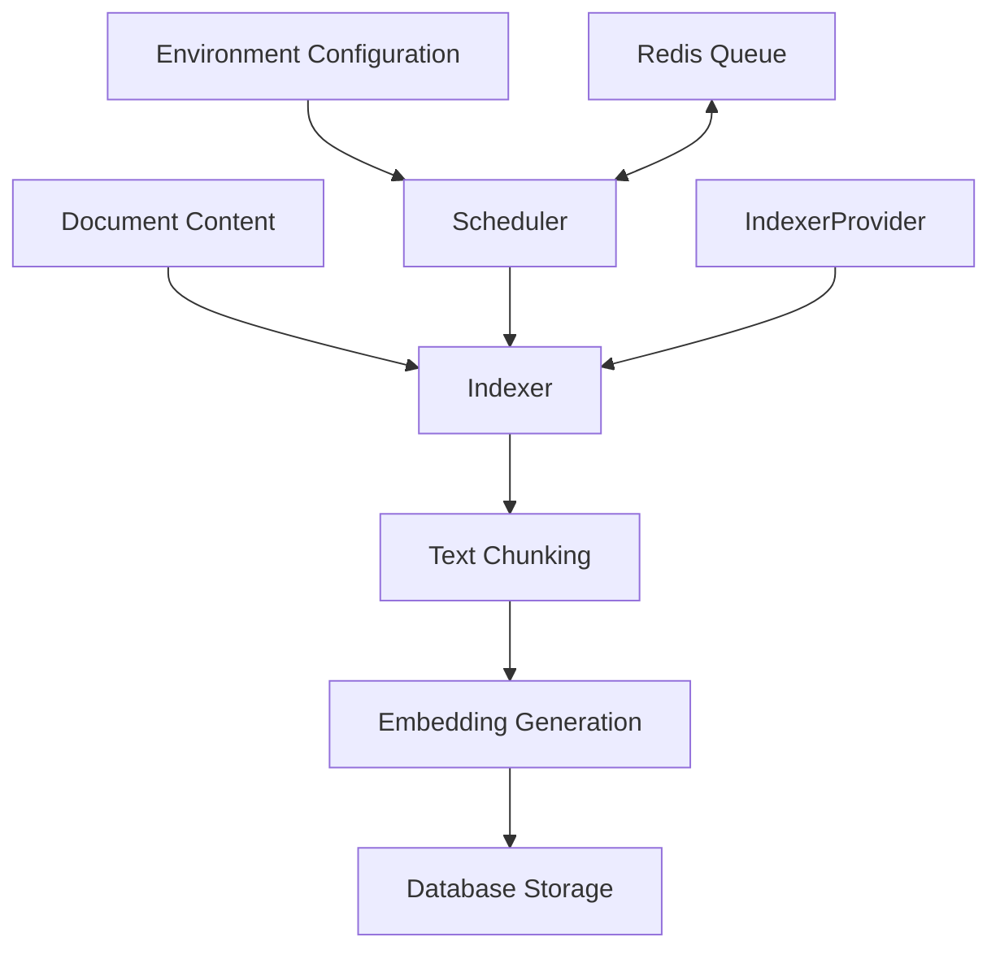
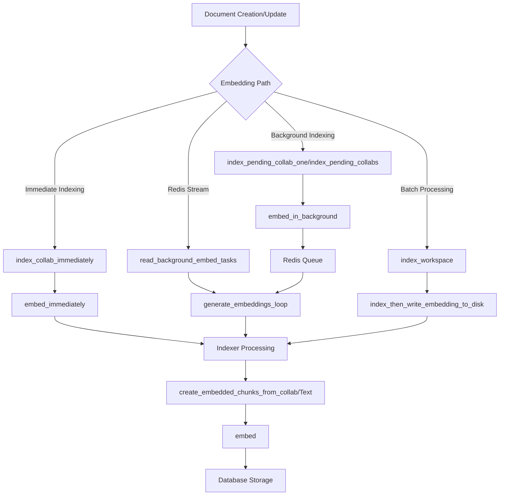
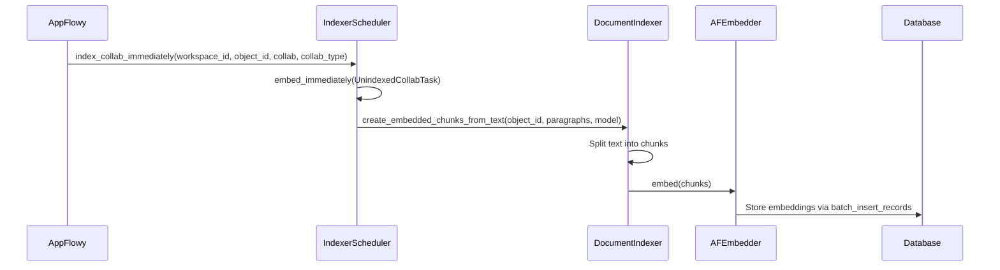
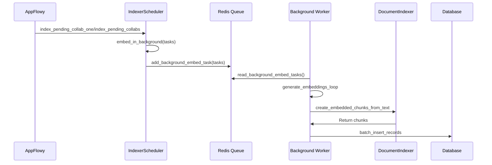
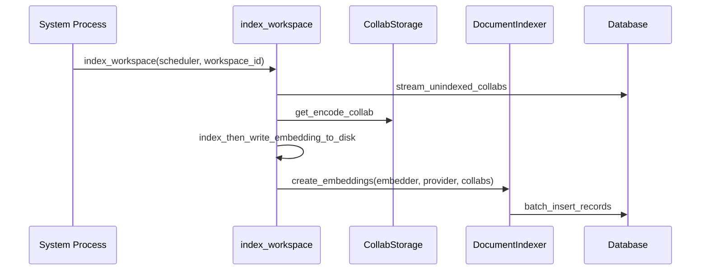
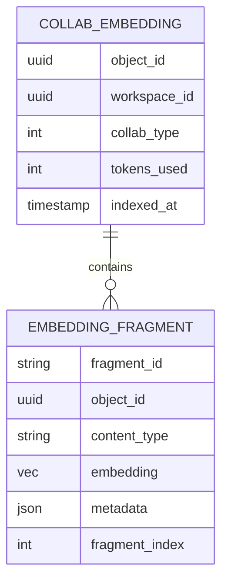

## Embedding Architecture (Do not edit, AI generated)

The indexing system consists of several interconnected components:



### Key Components

1. **Indexer**: Interface that defines methods for creating and embedding content chunks
2. **DocumentIndexer**: Implementation of Indexer specifically for document content
3. **IndexerProvider**: Factory that resolves the appropriate Indexer based on content type
4. **Scheduler**: Manages embedding tasks and coordinates the embedding process
5. **AFEmbedder**: Provides embedding capabilities through OpenAI or Azure OpenAI APIs

## Embedding Process Flow

### 1. Content Preparation

There are multiple paths that can trigger embedding generation in the system. Each path ultimately processes document
content, but they differ in how they're initiated and handled:



#### Path 1: Immediate Indexing

When a document is created or updated and requires immediate indexing:



#### Path 2: Background Indexing

For non-urgent indexing, tasks are queued for background processing:



#### Path 3: Batch Processing

For processing multiple unindexed documents at once, typically used for initial indexing or catch-up processing:



In all these paths, the content goes through similar processing steps:

1. Document content extraction (paragraphs from document)
2. Text chunking (grouping paragraphs into manageable chunks)
3. Embedding generation via the AI service
4. Storage in the database

### 2. Chunking Strategy

Documents are broken into manageable chunks for effective embedding:

1. The system extracts paragraphs from the document
2. Paragraphs are grouped into chunks of approximately 8000 characters
3. A consistent hash is generated for each chunk to avoid duplicate processing
4. Each chunk is prepared as an `AFCollabEmbeddedChunk` with metadata


### 3. Embedding Generation

The actual embedding creation happens via OpenAI or Azure's API:

1. Chunks are sent to the embedding service (OpenAI or Azure)
2. The API returns vectors for each chunk
3. Vectors are associated with their original chunks
4. Complete embeddings are stored in the database

## Technical Implementation

### Fragment Processing

```rust
fn split_text_into_chunks(
    object_id: Uuid,
    paragraphs: Vec<String>,
    collab_type: CollabType,
    embedding_model: EmbeddingModel,
) -> Result<Vec<AFCollabEmbeddedChunk>, AppError> {
    // Group paragraphs into chunks of roughly 8000 characters
    let split_contents = group_paragraphs_by_max_content_len(paragraphs, 8000);

    // Create metadata for the chunks
    let metadata = json!({
      "id": object_id,
      "source": "appflowy",
      "name": "document",
      "collab_type": collab_type
  });

    // Track seen fragments to avoid duplicates
    let mut seen = std::collections::HashSet::new();
    let mut chunks = Vec::new();

    // Process each content chunk
    for (index, content) in split_contents.into_iter().enumerate() {
        // Generate consistent hash for deduplication
        let consistent_hash = Hasher::oneshot(0, content.as_bytes());
        let fragment_id = format!("{:x}", consistent_hash);

        // Only add new fragments
        if seen.insert(fragment_id.clone()) {
            chunks.push(AFCollabEmbeddedChunk {
                fragment_id,
                object_id,
                content_type: EmbeddingContentType::PlainText,
                content: Some(content),
                embedding: None,
                metadata: metadata.clone(),
                fragment_index: index as i32,
                embedded_type: 0,
            });
        }
    }

    Ok(chunks)
}
```

## Embedding Storage

Embeddings are stored in the database with their associated metadata:



## Configuration

The embedding system is configurable through environment variables:

- `APPFLOWY_INDEXER_ENABLED`: Enable/disable the indexing system (default: `true`)
- `APPFLOWY_INDEXER_SCHEDULER_NUM_THREAD`: Number of threads for processing (default: `50`)
- `AI_OPENAI_API_KEY`: OpenAI API key for embeddings
- `AI_AZURE_OPENAI_API_KEY`, `AI_AZURE_OPENAI_API_BASE`, `AI_AZURE_OPENAI_API_VERSION`: Azure OpenAI configuration
